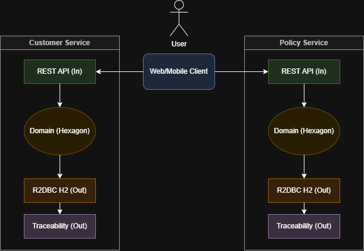
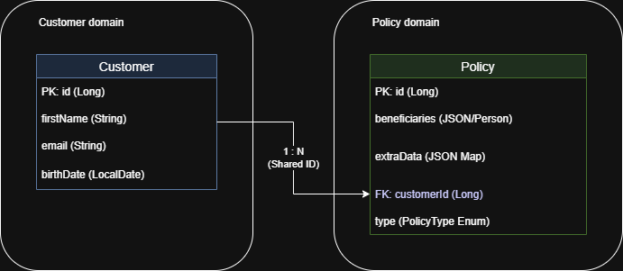
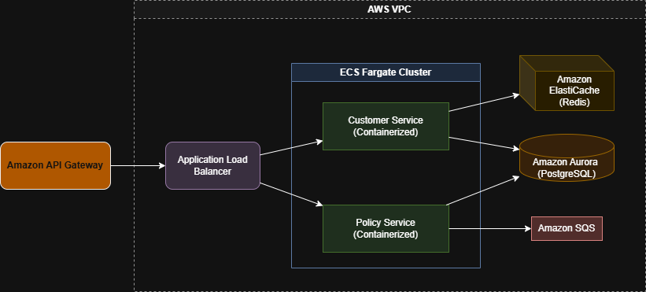

# Sistema de Gestión de Seguros


Este proyecto es una solución modularizada para la gestión de clientes y pólizas de una aseguradora, utilizando **JAVA 21**, **Spring Boot 3.4.3 (Webflux)** y una **Arquitectura Hexagonal**.

## Estructura del Proyecto

Los microservicios se encuentran organizados dentro de la carpeta `services/`:
- `services/customer-service`: Gestión de información de clientes.
- `services/policy-service`: Gestión de pólizas y reglas de negocio.

## Arquitectura

Se utiliza **Arquitectura Hexagonal (Puertos y Adaptadores)** para separar la lógica de negocio de la infraestructura:
- **Domain**: Modelos, puertos (interfaces), excepciones de negocio (`BusinessException`) y enums de error.
- **Application**: Servicios que implementan los casos de uso (puertos de entrada).
- **Infrastructure**: Adaptadores de entrada (REST Controllers) y salida (R2dbc Persistence).

### Manejo Global de Errores, Respuestas y Trazabilidad
Todas las APIs devuelven un formato de respuesta unificado `ApiResponse<T>` que incluye un identificador único de transacción para trazabilidad:
```json
{
  "transactionId": "uuid-generado",
  "message": "success",
  "code": 200,
  "data": { ... }
}
```
*   **Trazabilidad**: Se implementó una capa de trazabilidad (`TraceabilityAdapter`) que utiliza **Gson** (con soporte para `LocalDate` y `LocalDateTime`) para registrar entradas, salidas y errores de cada operación de negocio.
*   **TransactionId**: Generado automáticamente mediante un `WebFilter` y propagado a través de todo el flujo reactivo.
*   **Excepciones**: Uso de `BusinessException` para capturar violaciones de reglas de negocio, con mapeo automático en un `GlobalExceptionHandler` reactivo.

## Calidad de Código y Pruebas
El proyecto incluye una suite completa de pruebas unitarias para:
-   **Servicios (Capa de Aplicación)**: Pruebas de lógica de negocio y validaciones con `StepVerifier`.
-   **Controladores (Capa de Infraestructura)**: Pruebas de endpoints REST con `WebTestClient` y mocks de servicios.

## Documentación de API
Se ha generado una especificación consolidada de la API en formato OpenAPI:
-   `docs/api/openapi.yml`: Definición de endpoints de clientes y pólizas.

## Documentación de Arquitectura
Los diagramas detallados de la solución se encuentran en la carpeta `docs/diagrams/`:
-   `architecture.xml`: Diagrama de componentes y flujo de datos local.
-   `data-model.xml`: Modelo de datos de las entidades de seguros.
-   `aws-architecture.xml`: Propuesta de arquitectura escalable en AWS para 40M de clientes.

### Diagramas (PNG)

Diagrama de componentes y flujo local:



Modelo de datos:



### Fuentes editables (XML)

-   `docs/diagrams/architecture.xml`
-   `docs/diagrams/data-model.xml`
-   `docs/diagrams/aws-architecture.xml`

## Cómo Correr Localmente
1. Clonar el repositorio.
2. Tener instalado **Java 21**, **Docker** y **Docker Compose**.
3. Desde la raíz del proyecto, construir y correr los servicios:
   ```bash
   ./gradlew clean build
   docker-compose up
   ```
4. Acceder a los servicios:
   - Customer Service: `http://localhost:8081`
   - Policy Service: `http://localhost:8082`

## Acceso a Herramientas

- **Swagger UI**:
  - Customer Service: [http://localhost:8081/swagger-ui.html](http://localhost:8081/swagger-ui.html)
  - Policy Service: [http://localhost:8082/swagger-ui.html](http://localhost:8082/swagger-ui.html)
- **H2 Console (Webflux)**: Disponible en `/h2-console` en ambos servicios (habilitado para entorno de desarrollo).

### Swagger UI (Documentación de APIs)
- **Customer Service**: [http://localhost:8081/swagger-ui.html](http://localhost:8081/swagger-ui.html)
- **Policy Service**: [http://localhost:8082/swagger-ui.html](http://localhost:8082/swagger-ui.html)

### Consola H2 (Bases de Datos)
Debido a que el entorno es puramente reactivo (WebFlux), se habilitaron servidores web de H2 independientes:
- **Customer DB**: [http://localhost:8091](http://localhost:8091) (JDBC: `jdbc:h2:mem:customerdb`)
- **Policy DB**: [http://localhost:8092](http://localhost:8092) (JDBC: `jdbc:h2:mem:policydb`)
- **Credenciales**: Usuario: `sa` / Password: `password`

## Modelo de Datos

- **Customer**: `id`, `documentType`, `documentNumber`, `firstName`, `lastName`, `email`, `phone`, `birthDate`.
- **Policy**: `id`, `customerId`, `type` (VIDA, VEHICULO, SALUD), `extraData` (JSON con beneficiarios, vehículos, coberturas).

## Propuesta de Arquitectura en AWS

Para escalar a 40 millones de clientes:

1. **Computación**: **AWS Fargate (ECS)** para desplegar los microservicios en contenedores sin gestionar servidores.
2. **Base de Datos**: **Amazon Aurora Serverless (PostgreSQL compat)**. Soporta escalado automático y R2DBC.
3. **API Gateway**: **Amazon API Gateway** para exposición de servicios, autenticación (Cognito) y rate limiting.
4. **Almacenamiento**: **Amazon S3** para logs o documentos de pólizas.
5. **Caching**: **Amazon ElastiCache (Redis)** para reducir latencia en consultas frecuentes de clientes.
6. **Mensajería**: **Amazon SQS/SNS** o **Amazon MSK (Kafka)** para comunicación asíncrona entre servicios (ej. emitir factura al crear póliza).
7. **Seguridad**: **AWS WAF** frente al API Gateway y **AWS Secrets Manager** para credenciales.

Diagrama de referencia:


